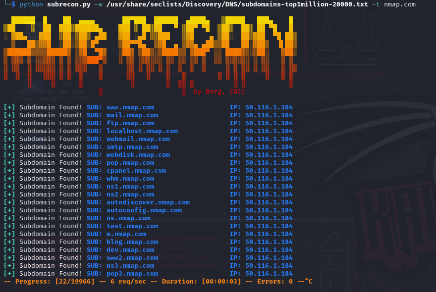

<div align="center">

# Subdomain Search Tool in Python


</div>

This is a simple Python script for performing a subdomain search on a target domain. The script utilizes DNS resolution to find and list active subdomains.
<div align="center">

---

# Features

</div>

```txt
Supports custom wordlists.
Displays a progress bar during the search.
Provides real-time updates of found subdomains.
```

<div align="center">

---

# Requirements

</div>

- Python 3.x
- Required libraries: dnspython, fade, argparse

<br>

You can install the required libraries using the following command:

```python
pip install dnspython fade argparse
```

---

<div align="center">

# Usage

</div>

Basic Usage:

The script can be executed from the command line by specifying the path to the wordlist and the target domain. Here is an example of usage:

```sh
python subrecon.py -w wordlist.txt -t targetdomain.com
```

In this example, the script will use the wordlist.txt file to search for subdomains of targetdomain.com.
